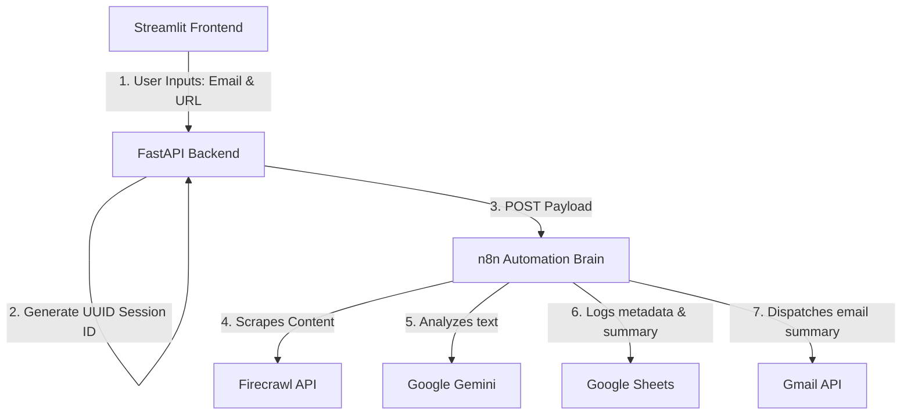

# 🤖 AI Agent Article Processor

A lightweight, production-ready Full-Stack AI automation workspace. This project scrapes web articles via **Firecrawl**, analyzes and summarizes the content using **Google Gemini**, logs key insights into **Google Sheets**, and delivers a beautiful summary report to the user's inbox via **Gmail**—all powered by a seamless combination of **FastAPI**, **Streamlit**, and **n8n**.

---

## 📐 System Architecture & Data Flow



1. **Frontend (Streamlit):** Gathers the user's email address and the target article URL, sending them securely to the local FastAPI backend.
2. **Backend (FastAPI):** Enforces data validation using Pydantic, generates a unique session ID for audit tracking, and forwards the payload to n8n.
3. **Automation Brain (n8n Workflow):** Coordinates scraping, LLM analysis, database logging, and email delivery.

---

## 📂 Project Structure

```text
├── backend.py            # FastAPI backend server
├── frontend.py           # Streamlit frontend user interface
├── My workflow.json      # n8n production & testing workflow schema
├── .env                  # Local environment configuration variables
├── .env.example          # Template environment configurations
├── .gitignore            # Version control exclusions
├── requirements.txt      # Python dependencies list
└── README.md             # Project documentation
```

---

## 🛠️ Setup & Installation

### 1. Prerequisites
Ensure you have the Python Launcher (`py`) installed on Windows (or Python 3.10+ on macOS/Linux).

### 2. Clone the Repository
```bash
git clone https://github.com/ShihabXSarar/AI-Agent-Article-Processor.git
cd AI-Agent-Article-Processor
```

### 3. Install Python Dependencies
```bash
py -m pip install -r requirements.txt
```

### 4. Configure Environment Variables
Copy `.env.example` to `.env` and adjust variables as needed:
```bash
copy .env.example .env
```
Inside `.env`:
```env
N8N_WEBHOOK_URL=https://kingrocco.app.n8n.cloud/webhook/2c551c09-cfa1-4b93-b387-4180d7681643
PORT=8000
HOST=127.0.0.1
```

---

## 🚀 Running the Project

To run both services simultaneously, open two terminal windows in the project directory:

### Terminal 1: Launch FastAPI Backend
```bash
py backend.py
```
*The backend server will spin up on [http://localhost:8000](http://localhost:8000).*

### Terminal 2: Launch Streamlit Frontend
```bash
py -m streamlit run frontend.py
```
*The frontend user interface will launch on [http://localhost:8501](http://localhost:8501).*

---

## 🕸️ n8n Integration & Import Guide

This workspace includes the official workflow blueprint: **`My workflow.json`**.

### How to Import it:
1. Open your n8n workspace dashboard.
2. Click on the top-right **Workflow settings menu** (three dots).
3. Select **Import from File...** and choose `My workflow.json`.
4. Configure your integrations credentials:
   - **Firecrawl API Connection**
   - **Google Gemini Credentials**
   - **Google Sheets OAuth2 Connection**
   - **Gmail Send Node**
5. **Activate** the workflow.

> [!NOTE]
> * **Testing Webhook:** If you want to run debug trials inside the n8n editor, toggle `N8N_WEBHOOK_URL` in `.env` to the `-test` webhook link and keep your n8n editor listening.
> * **Production Webhook:** For automated background execution, use the standard production URL and ensure the workflow toggle in n8n is set to **Active**.
